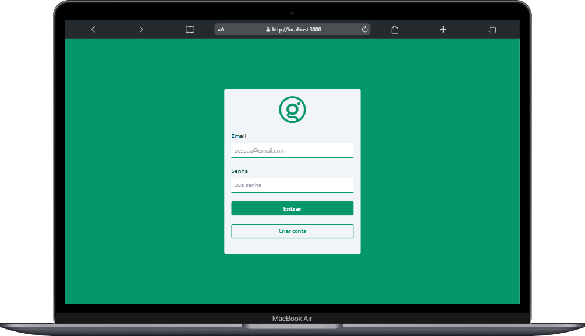
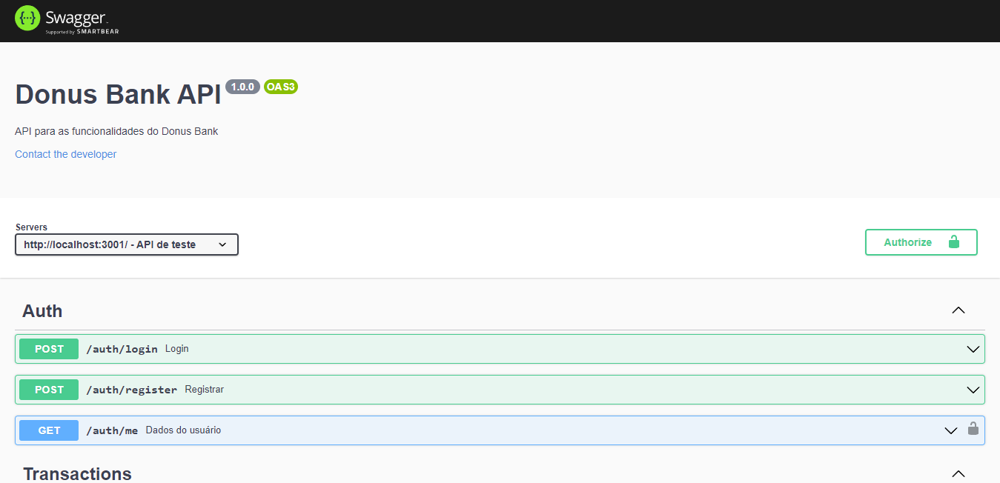
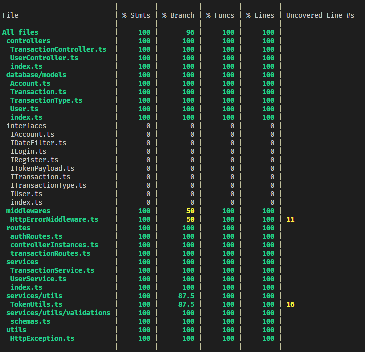
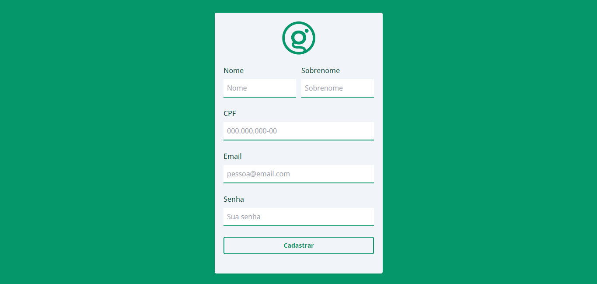

# 💰 Donus Bank



## 📡 Sobre

Aplicação full stack dockerizada desenvolvida em React e Node.js com TypeScript. Seu objetivo é realizar depósitos e transferências bancárias entre usuários.

<br />

## 📜 Habilidades desenvolvidas

- Desenvolver uma API Restful em Node.js, Express.js e TypeScript
- Dockerizar a aplicação com Docker Compose
- Utilizar um ORM
- Utilizar  um banco de dados MySQL
- Documentar a API com o framework Swagger UI
- Testes de integração no backend utilizando Mocha.js, Chai.js e Sinon.js com 100% de cobertura
- Desenvolver o frontend em React
- Utilizar Tailwind para a estilização do frontend

<br />

## ✔️ Metodologias

- Mobile First
- Aplicar os princípios da arquitetura SOLID
- Aplicar os princípios de POO (Programação Orientada a Objetos)

<br />

## ⚙️ Tecnologias

- Node.js
- React.js
- TypeScript
- Express.js
- Sequelize.js
- Tailwind
- MySQL
- Json Web Tokens
- Mocha.js
- Chai.js
- Joi
- Docker
- Docker Compose
- Swagger UI

<br />

# 🚀 Instalação e execução

<details>
<summary>Instalação e execução com Docker</summary>
<br />

Para rodar está aplicação é necessário ter **Git**, **Node**, **Docker** e o **Docker Compose** instalados no seu computador. O Docker Compose precisa estar na versão **1.29** ou superior e o Node na versão 16.

Para conseguir executar os comandos do abaixo também é necessário que seu sistema operacional tenha um terminal Bash instalado. Caso você esteja utilizando Linux ou macOS, o Bash já vem instalado por padrão. Porém, se o seu sistema for Windows, você pode [aprender como instalar](https://dicasdeprogramacao.com.br/como-instalar-o-git-no-windows/).

### 1 - Clone o repositório:

```
git clone git@github.com:lauropera/donus-bank.git
```

### 2 - Na raíz do projeto, suba os containers do frontend (`frontend_donus`),  backend (`backend_donus`) e o banco de dados (`db_donus`) com o comando:

    docker-compose up -d --build

Os containers estão mapeados nas seguintes portas:

- frontend_donus: 3000
- backend_donus: 3001
- db_donus: 3002

Para parar os containers, na pasta raiz do projeto execute o comando:

    docker-compose down

### 3 - Acessando o Frontend

Para acessar o frontend, vá em seu navegador acesse a rota:

    http://localhost:3000

## 4 - Usuários para fazer login

Nessa aplicação é necessário fazer o login com um email e senha. A tabela abaixo disponibiliza usuários pré-cadastrados para o acesso:

|        Email       |     Senha   |
| ------------------ | :---------: |
| mallu@artist.com   | sambinhabom |
| sebastian@sebs.com | piano       |

</details>
<br />

# 📚 Documentação



A documentação está disponivel através do Swagger. Acesse a rota http://localhost:3001/docs para ter acesso a documentação e testar a API. Se preferir, utilize um cliente de requisições HTTP de sua preferência (Insomnia, Thunder Client, etc) para fazer as requisições.

<br />

# ☕ Testes

<details>
<summary>Acessar a cobertura de testes</summary>

<br />

## Para você pode ver a cobertura dos testes utilize os seguintes comandos:

Entre no container do backend

    docker exec -it backend_donus sh

Execute o comando para ver a cobertura

    npm run test:coverage


</details>



<br />

# 📷 Screenshots



#

<div>
  <p align="center">🍐</p>
</div>